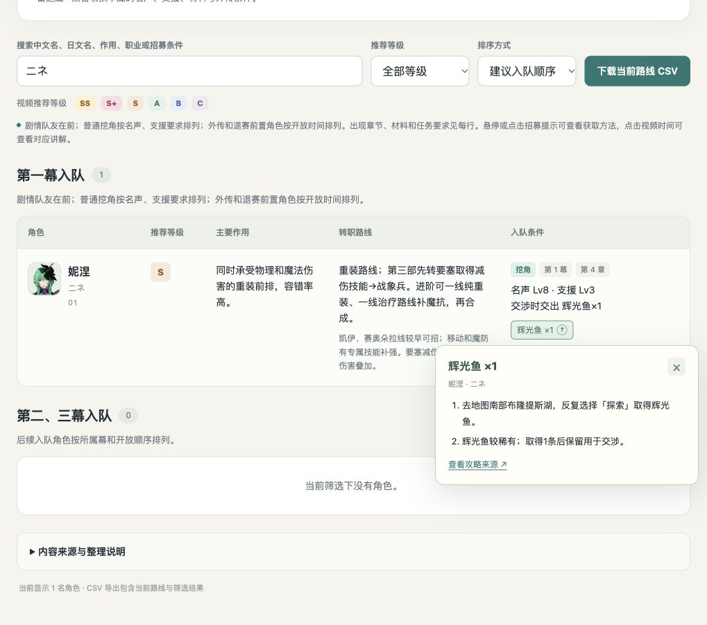

# 万缕千丝 · 角色培养推荐表

[**点击直接下载角色培养表**](https://github.com/rollingaiwj0520-ux/fefw-character-guide/releases/latest/download/fefw-character-guide.html)

无需登录 GitHub。下载后用浏览器打开 `fefw-character-guide.html` 即可使用，头像、样式、脚本和角色数据均包含在文件中。

- 63 个角色的头像、中文名、日文名、推荐等级、主要作用和转职路线。
- 选择凯伊、迪托利希、赛奥朵拉或蕾达，按对应路线的入队条件重新排序。
- 第一幕与第二、三幕分别列出。
- 悬停或点击物品、支线、外传标签，查看取得地点、完成步骤和对应攻略来源。
- 支持中文与日文搜索、推荐等级筛选、下载当前路线 CSV。

## 内容来源

- 培养评级、主要作用与转职建议：[穹渊Destiny 的 Bilibili 视频](https://www.bilibili.com/video/BV19wHZ6kE6r/)。
- 日文名与角色头像：[GameWith 角色资料](https://gamewith.jp/fefw/573109)。
- 第一幕日文名核对：[hyperWiki](https://hyperwiki.jp/fefw/character/)。
- 招募条件、时间和部分道具取得地点：[中文攻略资料](https://fire-emblem-fw.site/recruit.html)与 [GameWith 招募攻略](https://gamewith.jp/fefw/574062)。

表内保留原视频、相关攻略及各项取得方法的来源链接。
